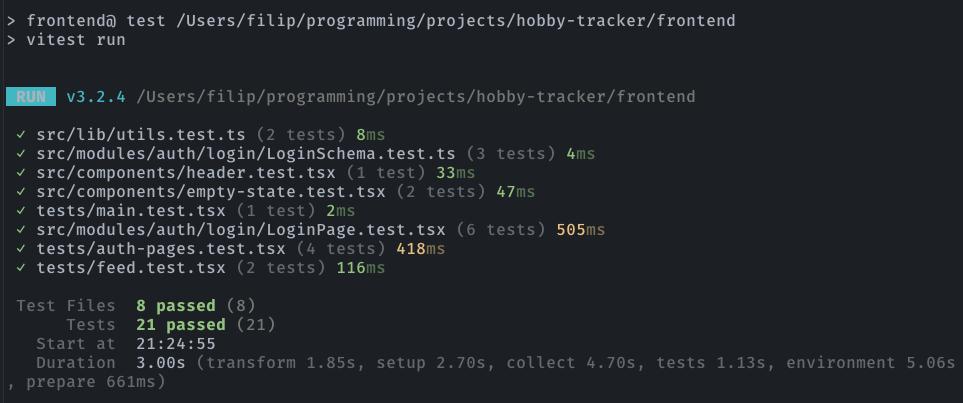

# Frontend

## Uruchomienie

- Zainstaluj zależności:

```bash
pnpm install
```

- Uruchom aplikację:

```bash
pnpm dev
```

- Zanim otworzysz przeglądarkę, upewnij się, że backend jest uruchomiony lokalnie na porcie 8787, ponieważ frontend będzie próbował się z nim połączyć, aby pobrać dane. Jeśli backend nie jest uruchomiony, to frontend może wyświetlać błędy związane z brakiem połączenia z API.

- Otwórz przeglądarkę i przejdź do `http://localhost:5173`

## Użyte technologie

- React
- TypeScript
- Tanstack Router
- Tanstack Query
- Tailwind CSS
- Vitest
- Shadcn UI
- Cloudflare Pages - hosting

## Architektura

- api - folder z wygenerowanym przez openapi-generator klientem axios, który jest używany do komunikacji z backendem
- routes - folder z plikami odpowiadającymi poszczególnym stronom aplikacji
- components - folder z komponentami wielokrotnego użytku, zawiera także folder z komponentami UI z biblioteki shadcn
- integrations - folder z integracjami pomiędzy różnymi częściami aplikacji, np. motywy, contexty itp.
- hooks - folder z customowymi hookami, np. do obsługi zapytań
- lib - folder z funkcjami pomocniczymi, używanymi w różnych miejscach aplikacji
- modules - folder, który zawiera wszystkie rzeczy związane z danym 1 routem, np. jeśli mamy route feed to w modules/feed będzie folder components z komponentami specyficznymi dla tego route, folder hooks z hookami specyficznymi dla tego route i ewentualnie inne rzeczy, które są związane tylko z tym route, jeśli strona ma np. więcej podstron, to dzielimy wtedy ten moduł na podmoduły, np. modules/feed/posts i modules/feed/comments, w zależności od tego jak duża jest ta strona
- tests - folder z testami jednostkowymi

## Testy



## Komunikacja z backendem

Komunikacja z backendem odbywa się za pomocą wygenerowanego przez bilbiotekę @openapitools/openapi-generator-cli klienta axios, który znajduje się w `src/api/generated`. W `src/api/index.ts` tworzymy instancję tego klienta i eksportujemy ją, aby można było jej używać w całej aplikacji. Aby wygenerować klienta, należy mieć zainstalowaną javę i uruchomić komendę:

```bash
pnpm run generate:api
```

Zimportowany klient API powinien mieć wszystkie potrzebne metody, które są w danym kontrolerze na backendzie.

>**Uwaga dla developmentu**: Requesty typu 'multipart/form-data', które wysyłają pliki, się źle generują i nie są obsługiwane poprawnie przez klienta. Trzeba używać apiHttpClient i wysyłać requesty ręcznie.
